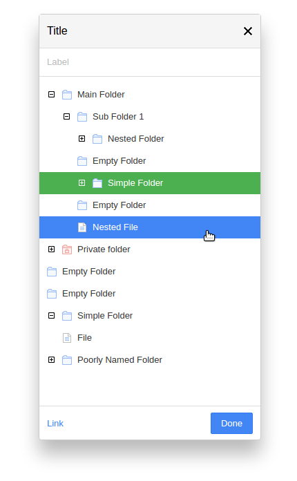

# Tree Explorer
A folder and file explorer (or tree control) built using React.



## Getting started
Clone the repo and run the following
```
$ cd tree-project
$ npm install
$ npm start
```
Then open [http://localhost:3000/](http://localhost:3000/) in your browser.

See files in `src/components` directory for code and styling.
